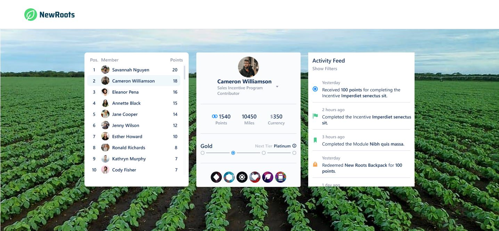

# Challenge Eureka

### Descrição

Criação de um projeto responsivo que possa visualizar o detalhe de um usuário e suas atividades.

## Layout

<p align="center">
 
</p>

## Protótipo
- [Link](https://www.figma.com/proto/23JH8HYpZv232BDAB3UC57/Test?node-id=14%3A4878&scaling=min-zoom&page-id=0%3A1&starting-point-node-id=14%3A4707)

A URL da imagem de fundo deve ser extraida da [API do Bing](https://www.bing.com/HPImageArchive.aspx?format=js&idx=0&n=1&mkt=pt-BR).


## Requisitos

- Preferencialmente faça em React, mas você pode usar outras bibliotecas ou frameworks (Angular, Vue.js, etc) ou JavaScript puro, fique a vontade.
- Para a folha de estilo, você pode usar o que preferir (CSS, SASS, LESS, CSS Modules, CSS-in-JS, etc).

## O que iremos avaliar
- O projeto funciona como esperado: O passo-a-passo pedido para rodar a aplicação funciona?
- Organização do código: Separação de módulos e organização do projeto (back-end e front-end).
- Clareza: O README explica de forma resumida qual é o problema e como pode rodar a aplicação?
- Assertividade: A aplicação está fazendo o que é esperado? Se tem algo faltando, o README explica o porquê?
- Legibilidade do código: É fácil ler e entender o código? Existem muitas variáveis/funções com nome enigmático? Comentários no código ajudam a explicar o fluxo?
- Segurança: Existe alguma vulnerabilidade clara?
- Cobertura de testes Qualidade e cobertura dos testes (não esperamos cobertura completa).
- Histórico de commits Qualidade e estrutura dos commits.
- UX: A interface é de fácil uso e auto-explicativa? As rotas/métodos da API são intuitivos?
- Escolhas técnicas: A escolha das bibliotecas, arquitetura etc, é a melhor escolha para a aplicação?

## API

```java
  [URL]: https://challenge-fielo.herokuapp.com
  [APP_ID]: MIGfMA0GCSqGSIb3DQEBAQUAA4GNADCBiQKBgQCh7uxHjWd1CyRgPD4XHcIPKiDb
```

- **/auth** [POST] - Endpoint responsável pela autorização da aplicação, é necessário adicionar a chave `x-app-id` com  `[APP_ID]` 
- **/users** [GET] - Endpoint responsável por retornar todos os users.
- **/users/id** [GET] - Endpoint responsável por retornar o perfil do user.
- **/users/id/activities** [GET] - Endpoint responsável por retornar as atividades do usuário.
- **/programs/id** [GET]- Endpoint responsável por retornar todos os programs.
- **/programs/id/levels** [GET]- Endpoint responsável por retornar todos os programs.
- **/levels/id** [GET]- Endpoint responsável por retornar todos os programs.

## Exemplo da autorização
```java
var request = require('request');
var options = {
  'method': 'POST',
  'url': 'https://challenge-fielo.herokuapp.com/auth',
  'headers': {
    'x-app-id': 'MIGfMA0GCSqGSIb3DQEBAQUAA4GNADCBiQKBgQCh7uxHjWd1CyRgPD4XHcIPKiDb'
  }
};
request(options, function (error, response) {
  if (error) throw new Error(error);
  console.log(response.body);
});
 ```
 
 ## Resultado da autorização
 
```java
{
    "auth": true,
    "token": "TOKEN_JWT"
}
```

## Exemplo do consumo dos dados
```java
var request = require('request');
var options = {
  'method': 'GET',
  'url': 'https://challenge-fielo.herokuapp.com/users',
  'headers': {
    'x-access-token': 'TOKEN_JWT'
  }
};
request(options, function (error, response) {
  if (error) throw new Error(error);
  console.log(response.body);
});
 ```
Boa sorte!
